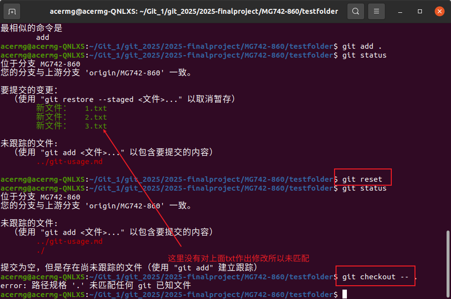
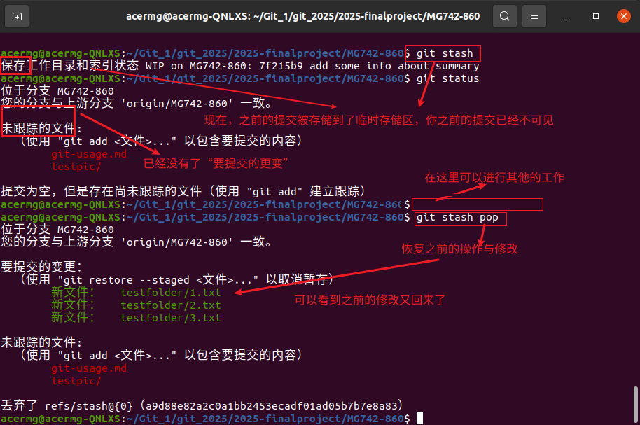
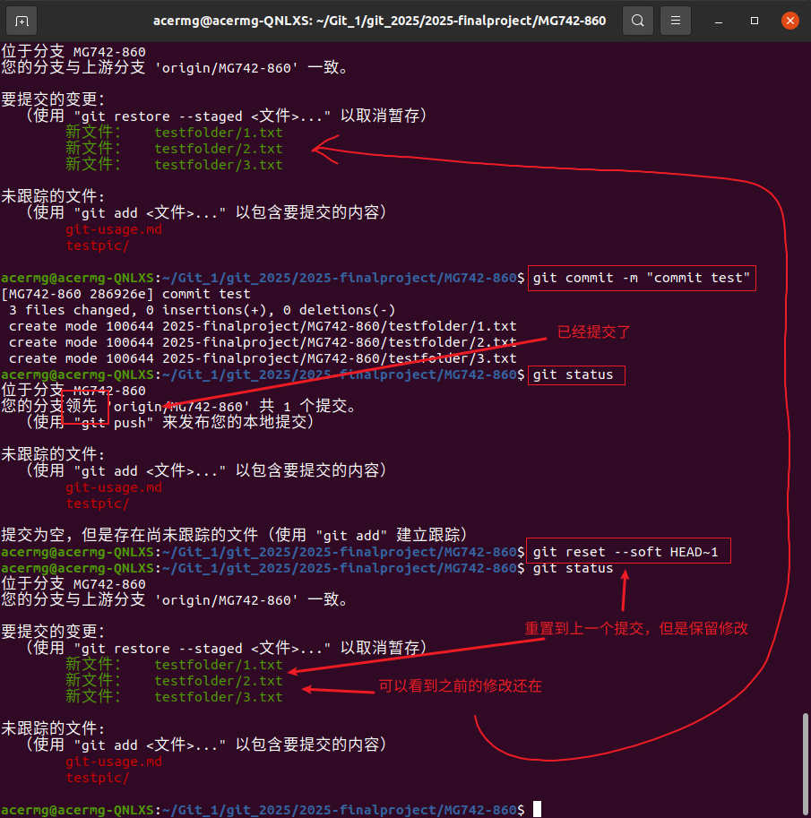
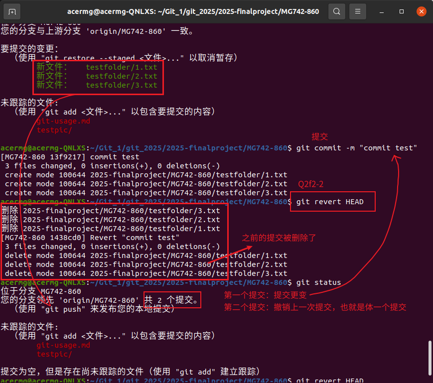
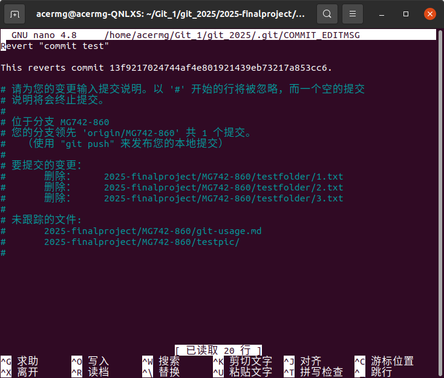
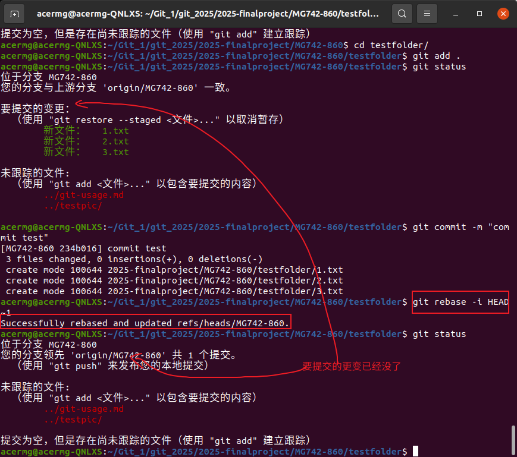
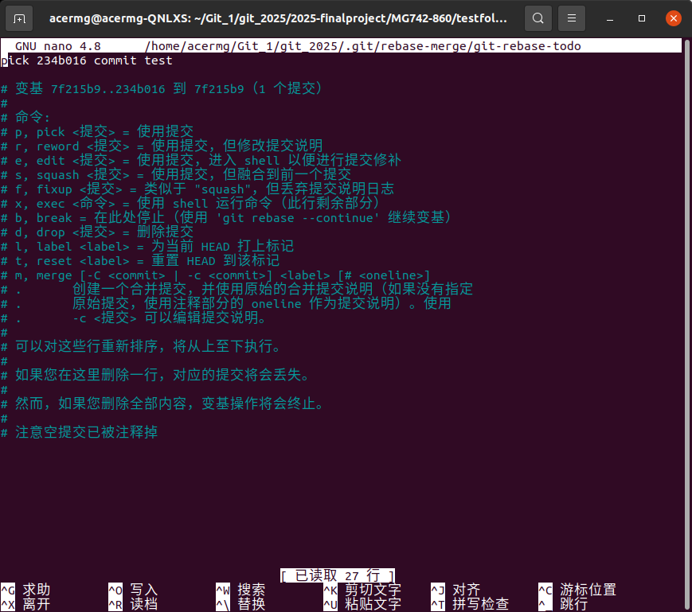
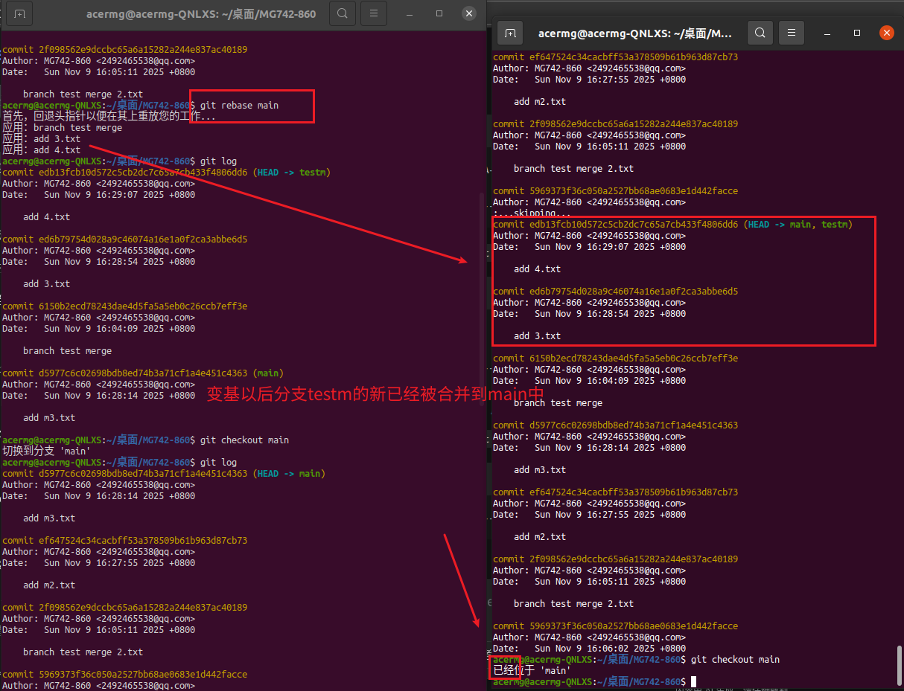
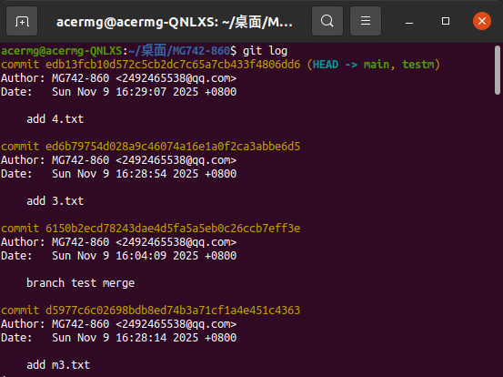
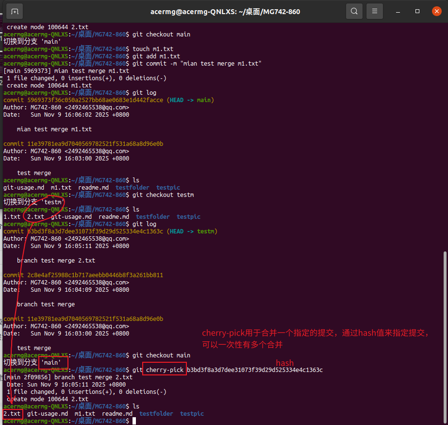

# Q1：回退修改
***
#### 方法一：逐步回退这些修改
```bash
# 回退暂存区修改（取消暂存），已经add的文件会从暂存区一处，但文件修改还在
git reset

# 回退工作区的所有修改
git checkout -- .

# 或者回退特定文件
git checkout -- filename.file
```

#### 方法二：直接重置到最新的一个提交状态
```bash
git reset --hard HEAD
```

#### 方法三：存储修改
```bash
# 先将修改放到临时存储区
git stash

# 再从存储栈中取出并应用最新的存储
git stash pop
```

# Q2：回退已经提交的版本
## 不修改历史
#### 方法一：使用reset
```bash
# 重置到上一个提交，但保留修改在暂存区。
git reset --soft HEAD~1
```

#### 方法二：使用revert
```bash
# 撤销了HEAD提交（最新），历史记录完整保留，新增了一个操作“撤销”，也就是“撤销”提交
git revert HEAD
```


## 修改历史
#### 方法一：硬重置
```bash
# 回退到上一个提交，丢弃所有修改
git reset --hard HEAD~1

# 强制更新远程分支，覆盖远程分支的历史记录
git push --force-with-lease
```

#### 方法二：交互式重写
```bash
# 完全重写提交历史
git rebase -i HEAD~1
```


# 合并分支的不同方式
#### 方法一：merge（题目给的一种）
```bash
# 合并分支 target-branch
git merge target-branch # 快速前进
git merge --no-ff feature-branch # 非快速前进
```
题目给的，这里就不用图片演示了。
#### 方法二：rebase
```bash
# 使用变基命令将当前分支的提交在目标分支上重新应用，创建线性的提交历史，不产生合并提交
git rebase branch
```



#### 方法三：cherry-pick
```bash
# 将指定提交的修改应用到当前分支，只提交特定的提交，而不是整个分支
git cherry-pick <commit-hash>

# 应用一系列连续的提交
git cherry-pick <start-commit>..<end-commit>
```
